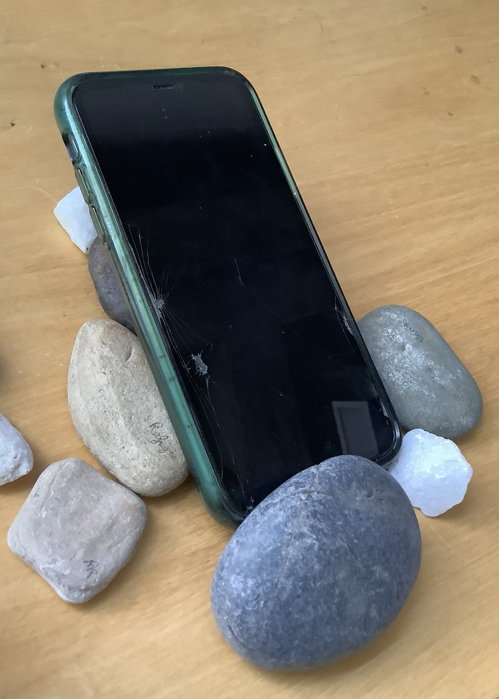

# Hello DES INV 202 Student!
Welcome to your new GitHub repository! 

# Outline
[week 1](README.md#week-1-example-report-1)

[week 2](README.md#week-2-My-report)

# Week 1: My Report #
## Week of 09/05/2024

This week, I designed a cool phone stand made of rocks. Check out all my cool sketches and progress photos from this week below, etc., etc....

# Week 2: My Report #

This week, I tried to use grasshopper (in Rhino 8) for parametric modeling. 

Firstly, I learned some basic operations through Youtube tutoring video. Then, I followed demo file and tried making the same thing.

1. Firstly，create a suqare plane

2. Input parameters and linked boxes

3. Try to bake the cube

Here are some of my thoughts and conclusions about using Grasshopper

