# Hello DES INV 202 Student!
Welcome to your new GitHub repository! 

# Outline
[week 1](README.md#week-1-example-report-1)

[week 2](README.md#week-2-My-report)

[week 3](README.md#week-3-My-project)

# Week 1: My Report #
## Week of 09/05/2024

This week, I watched a video on how to use jacobs hall's laser cutter and completed the tutorial.

# Week 2: My Report #
## Week of 09/09/2024

This week, I tried to use grasshopper (in Rhino 8) for parametric modeling. 

Firstly, I learned some basic operations through Youtube tutoring video. Then, I followed demo file and tried making the same thing.

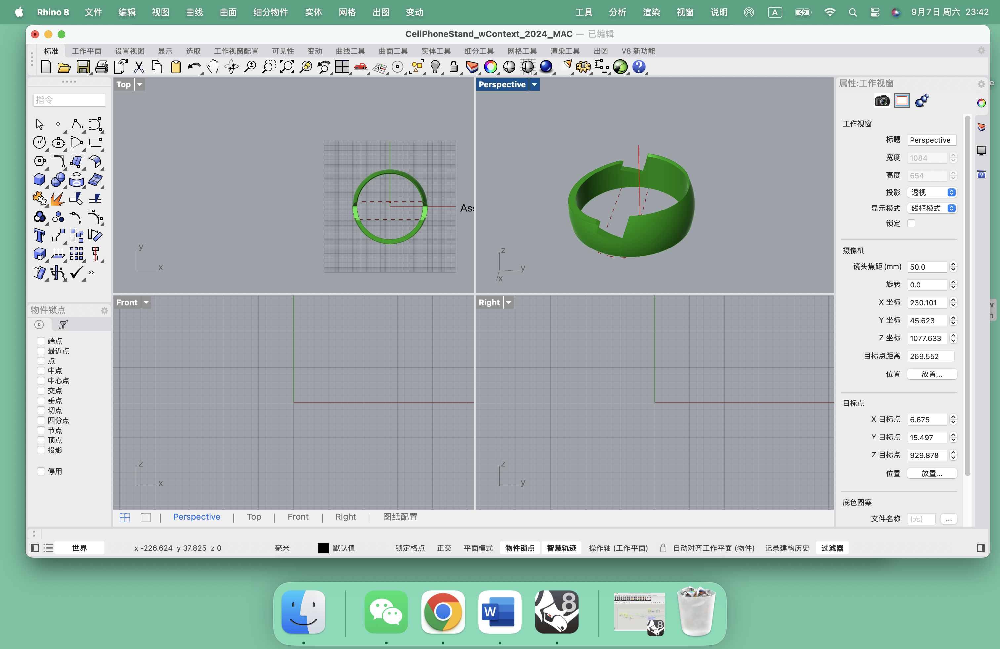

1. Create a suqare plane

2. Input parameters and linked boxes

3. Extrude a square border to make a box

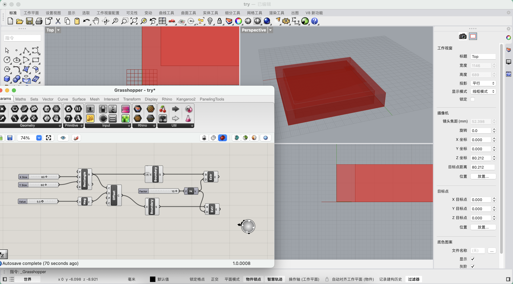

4. Different from step 3, extrude a wall without floor(Take the space between the two boxes and extrude it)

On Monday Course:

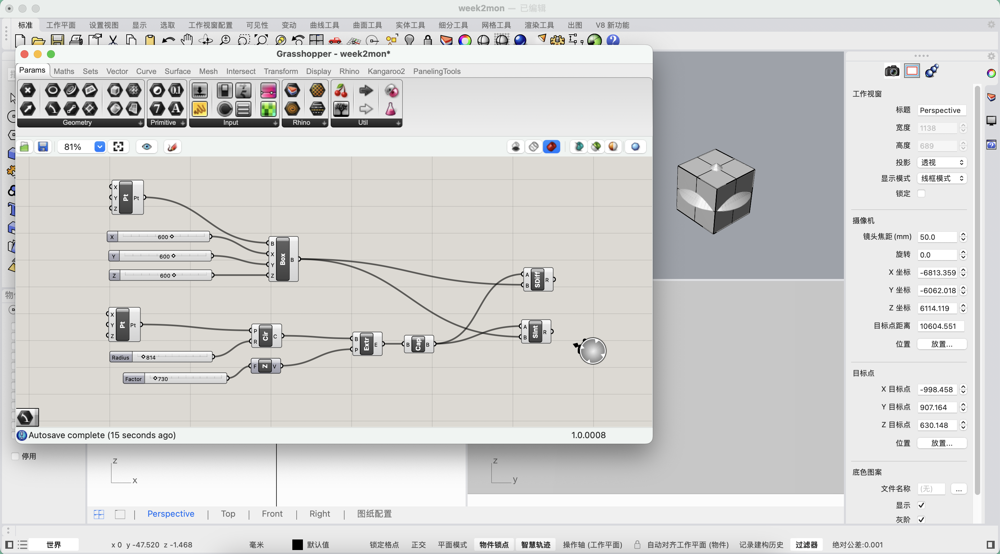

Here are some of my thoughts and conclusions about using Grasshopper
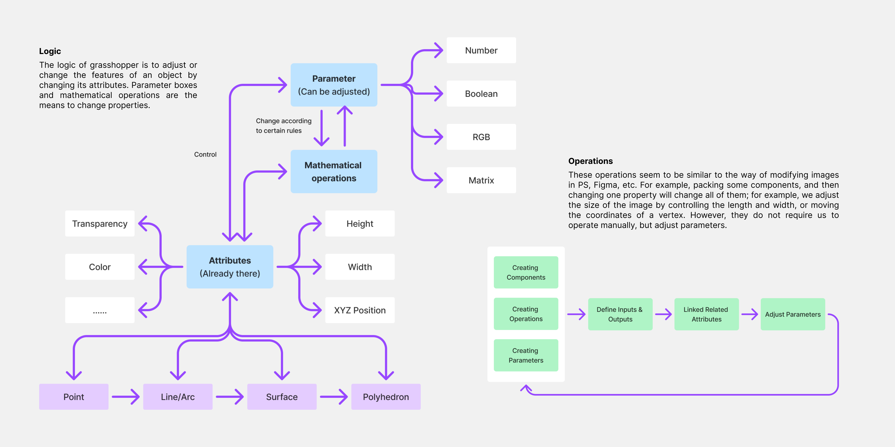

# Week 3: My Project #
## Week of 16/09/2024

This week, I began to design my own grasshopper project. 

I'd like to create a Night Light with decoration function. Here is the process:

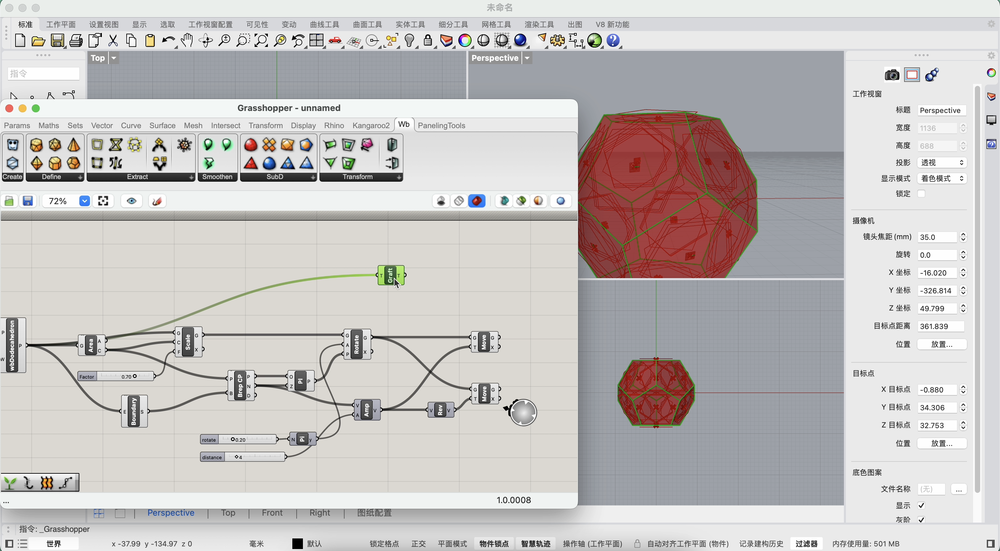

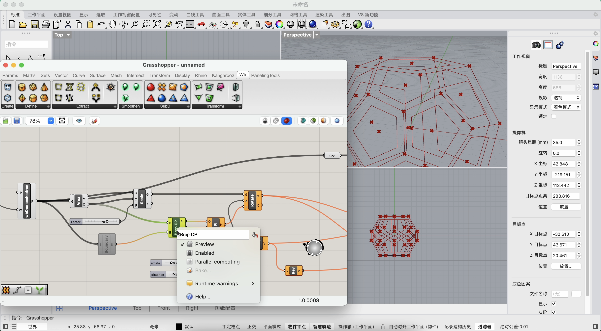

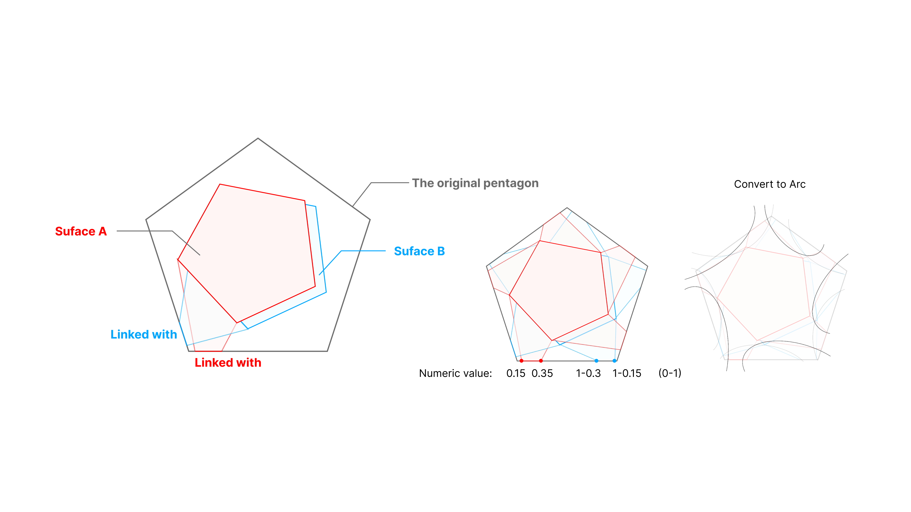

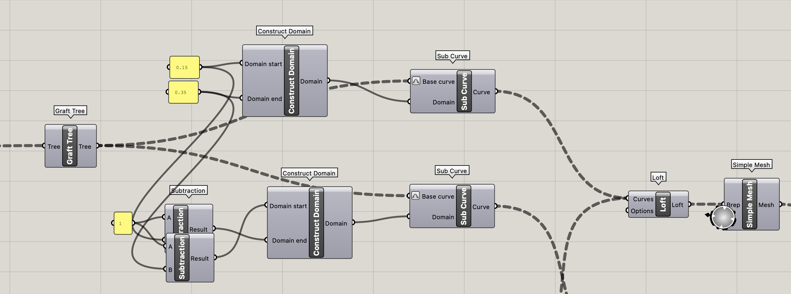

Scale parameter:

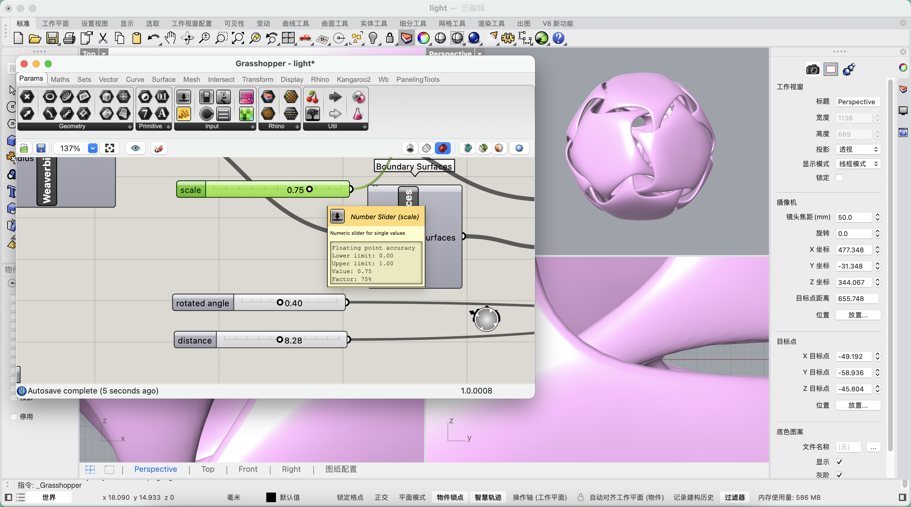

Rotate parameter:

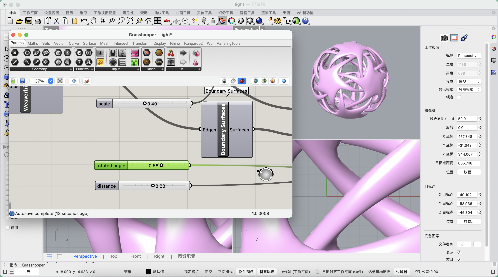

Distance parameter:

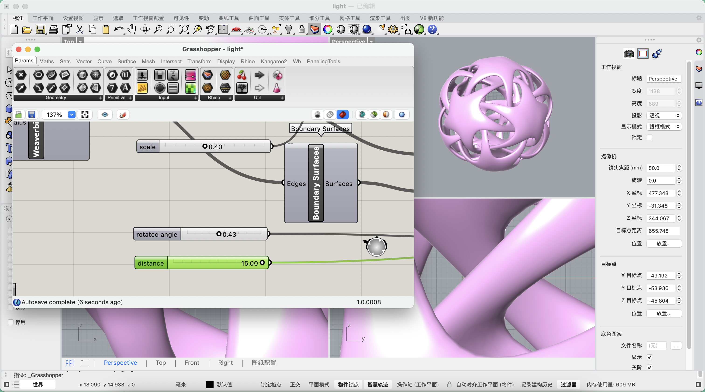

Rendering:

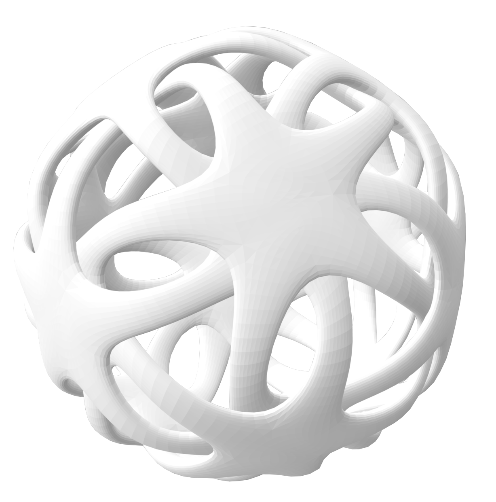

3d Printing:

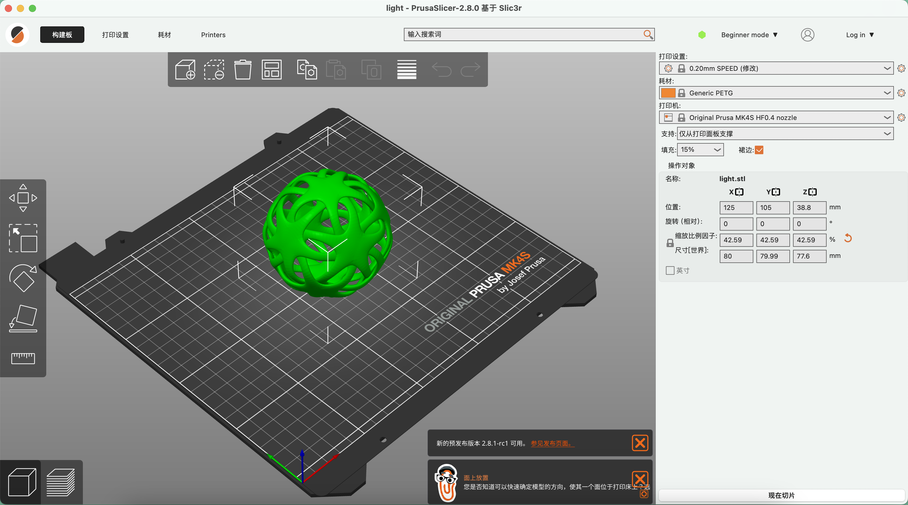

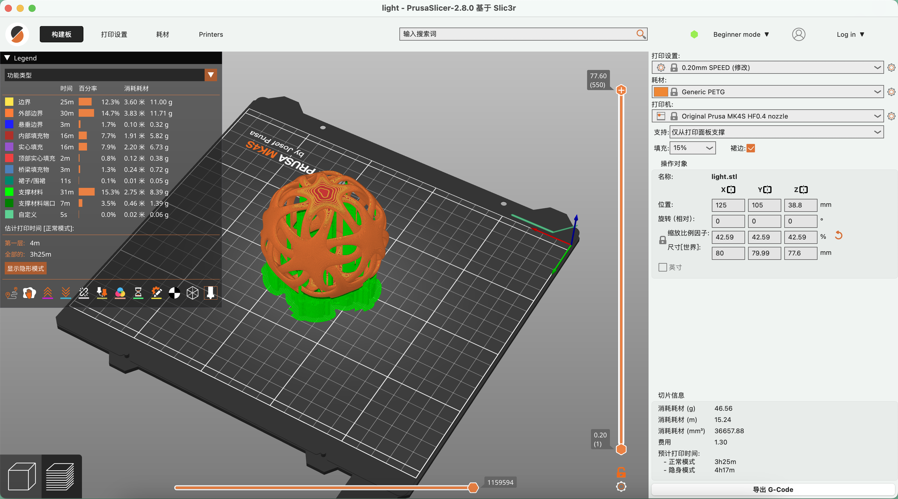

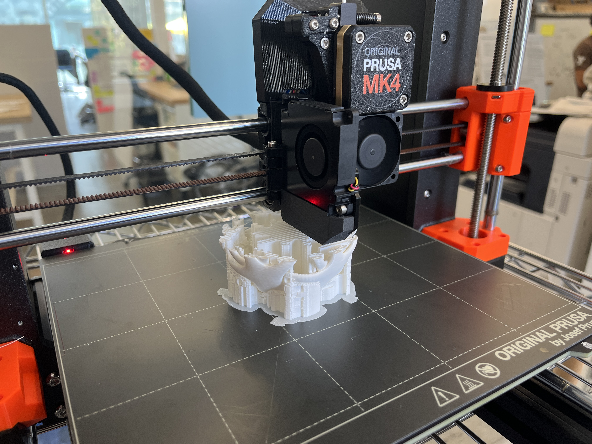

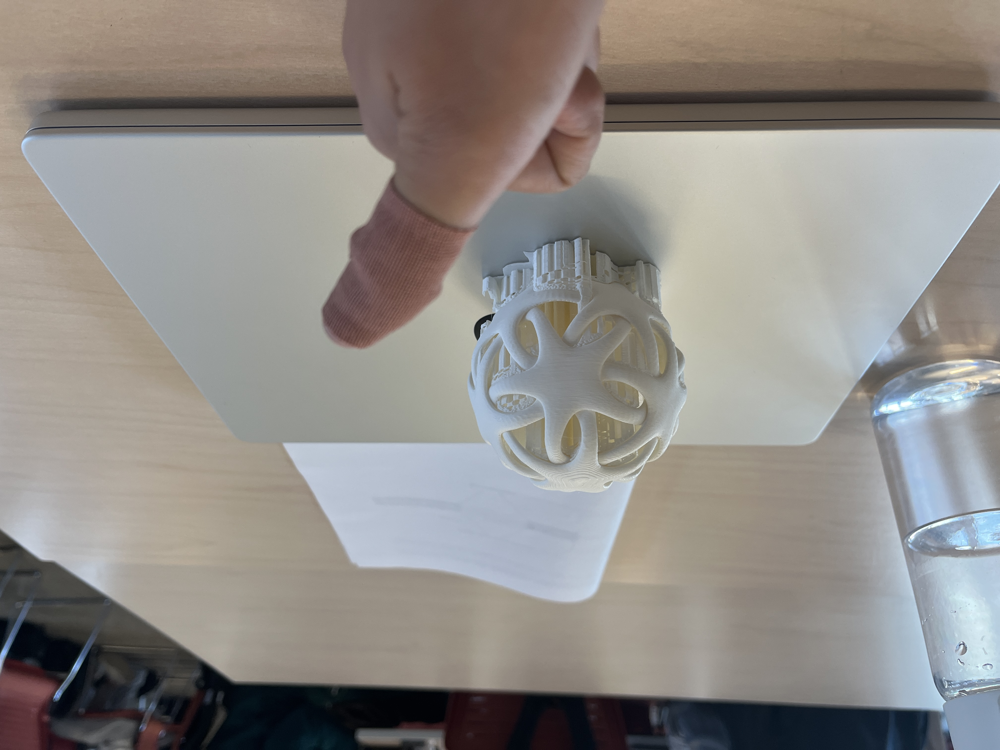

# Week 4: My Report #
## Week of 23/09/2024

1. Digital Ecosystem 

2. Photon 2(module)
- Just like Arduino ide, using wi-fi to communicate(interact) between objects and human
- Programing language: C++
- More popular
- Can be written inside VScode
- Pins: digital & anolog Inputs
- 3V
- USB Power

3. Human computer interaction(HCI)
- Human -> Hardware -> Circuit -> Software
- Input vs. Output

4. Physical computing
- 

