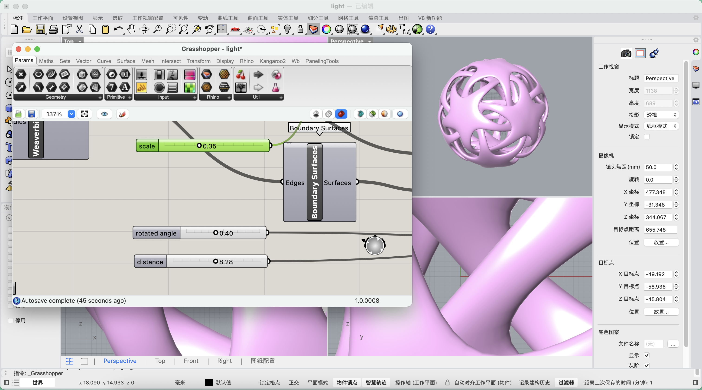

# Hello DES INV 202 Student!
Welcome to your new GitHub repository! 

# Outline
[week 1](README.md#week-1)

[week 2](README.md#week-2)

[week 3](README.md#week-3)

[week 4](README.md#week-4)

[week 5](README.md#week-5)

# Week 1 #
## 09/05/2024 Thursday

This week, I watched a video on how to use jacobs hall's laser cutter and completed the tutorial.

# Week 2 #
## 09/09/2024 Monday

This week, I tried to use grasshopper (in Rhino 8) for parametric modeling. 

Firstly, I learned some basic operations through Youtube tutoring video. Then, I followed demo file and tried making the same thing.

1. Create a suqare plane

2. Input parameters and linked boxes

3. Extrude a square border to make a box

4. Different from step 3, extrude a wall without floor(Take the space between the two boxes and extrude it)

On Monday Course:

Here are some of my thoughts and conclusions about using Grasshopper

# Week 3: My Report #
## 16/09/2024 Monday

This week, I began to design my own grasshopper project. 

I'd like to create a Night Light with decoration function. Here is the process:

Scale parameter:

Rotate parameter:

Distance parameter:

Rendering:

## 19/09/2024 Thursday

3d Printing:

# Week 4 #
## 23/09/2024 Monday

1. Digital Ecosystem
- Consideration
     - Rapid prototyping
     - Making a thing
     - Interactive art

- Examples: Multimodal interaction
     - Voice recogintion
     - Gesture recogintion
     - ......

3. Photon 2(module)
- Just like Arduino ide, using wi-fi to communicate(interact) between objects and human
- Programing language: C++
- More popular
- Can be written inside VScode
- Pins: digital & anolog inputs/outputs
- 3V
- USB Power

3. Human computer interaction(HCI)
- Human -> Hardware -> Circuit -> Software
- Input vs. Output

4. Physical computing
- Interactive system <-> Interaction(Sensor) <-> Real world
- Sub-categories (paper-Mareen Przyblle,2018)
- Mental model(huamn sensing, physical boundary, virtual)

5. Microcontroller

6. VS code
- bash (Curl -X GET "route of file")
- pipe

7. Homework: Diagram

In a smart home ecosystem, users interact primarily through interfaces such as mobile applications or voice assistants. These interfaces allow users to issue commands, monitor device status, and customize settings for their home environment. For instance, a user might adjust lighting or temperature via a smartphone app.

Smart home devices, including smart bulbs, thermostats, and security cameras, connect to an IoT platform, which acts as a centralized hub. This platform facilitates communication between various devices and enables data management. When a user sends a command through the interface, the IoT platform processes it, ensuring the appropriate device responds accordingly.

Environmental factors are continuously monitored by sensors integrated into the smart home system. These sensors collect data on temperature, humidity, and occupancy. This information is transmitted to the IoT platform, allowing for real-time adjustments. For example, if a motion sensor detects a presence, the system might trigger lights or adjust the thermostat.

Overall, the interaction between users, interfaces, smart devices, IoT platforms, and environmental conditions creates a seamless and automated living experience, enhancing comfort, security, and energy efficiency in the home.

## 26/09/2024 Thursday

Photon2 environment configuration and preliminary attempts:

- The code initially contains two necessary functions: void setup() and void loop(). We can also add our own functions later, such as void button_pressed().
- Variables include global variables and local variables. The difference is the scope of their application.
- We can use C++ syntax to control variables if(), x++, etc.
- pin connects physical sensor and photon2 (connects to cloud), and the code communicates with cloud and photon2 through #include "Particle.h" to control the output entity

About code and physical I/O device

     a. Input device
          
          - When adding a new input, you need to set a new pin interface and variable in the code, such as pin_t button_in=D2;
          - In addition, related variables (of different data types) will be added, such as bool(determin the button is pressed //1 or not //0)
          - If you want to call it conveniently, you can also add new functions, such as void button_pressed(){}

     b. Output device
         
          - We need to determine what inputs, variables, and functions control the output.
          - In addition, you need to determine what the output mode is, such as whether the small light bulb is always on, the small light bulb is on every 2 seconds, etc.

## 30/09/2024 Monday
Timming System

1）Required Components:
     
     - Photon2 board
     - Button
     - LED
     - 220-ohm resistor (for the LED)
     - Breadboard and wires

2）Circuit Setup:
   
     - Connect one terminal of the button to Digital pin on the Photon2 and the other terminal to ground.
     - Connect the anode of the LED to a pin and the cathode to a resistor connected to ground.

3）Pseudocode

// Setting
- Define pin numbers for Button and LED
- Variables to store button state and timing
- Setup duration for timing (e.g. 5 minutes in milliseconds)

// Funtion
void setup() {
  - Set button pin as input
  - Set LED pin as output
  - Ensure LED is off initially
}

void loop() {
  - Check if button is pressed
    -If Yes: Start timing
         - Record the start time
         - Start serial for debugging("Timing started!")
  - If timing has started, check if 5 minutes have passed
         - If 5 minutes have passed, change LED status
}

System missing in my life
- Plant Watering Timer: A system that reminds you when to water your plants. It could use moisture sensors to track soil moisture and notify you when it’s time to water.
- Cooking Timer with Multiple Alarms: A timer that can keep track of multiple cooking times for different dishes. Each alarm could trigger a different LED color or sound.
- Sleep Aid System: A timer that gradually dims lights and plays soothing sounds over a period of time to help you fall asleep.

# Week 5 #
## 03/10/2024 Thursday

1. Button -> LED pulse rate

     a. Difference:
        - User Interaction: These demos emphasize user input through a physical button, making the interaction more responsive
        - Control Mechanism: Instead of pre-programmed behaviors, these projects allow for real-time control, which can lead to varied outcomes based on user actions.
        - Visual Feedback: The LED pulsing creates a visual representation of user input, enhancing engagement compared to previous examples that might not have such feedback mechanisms.

     b. Smilarity:
        - Basic Components: They still utilize fundamental electronics like LEDs, buttons, and possibly microcontrollers, similar to past projects.
        - Programming Logic: The use of conditional statements and loops remains consistent across both types of projects.

     c. Expanded:
        - A feature that could be particularly relevant to daily life might be mood-based lighting, where users can input their current mood through the button (e.g., happy, relaxed, focused), and the LED pulse adjusts accordingly.

     d. Machine Learning:
        - Machine learning could enhance this system by analyzing user interactions over time to predict mood preferences. For instance, it could learn that a user prefers a slow pulse when winding down in the evening and automatically adjust the settings.

     e. Large ecosystem:
        - A combined ecosystem, one could envision a smart home lighting system that integrates multiple devices

2. Accel -> Servo

     a. Difference:
   
          - Sensor Interaction: This project uses an accelerometer, allowing control through physical movement, unlike previous projects that relied on buttons or fixed inputs.

          - Real-Time Feedback: The system responds instantly to tilting or movement, making it more intuitive and dynamic than slower controls.

          - Applications: This setup can be applied in robotics, gaming, and gesture control, broadening its uses compared to more static projects.

     b. Smilarity:
   
          - Basic Components: The use of microcontrollers, servos, and coding remains consistent with prior projects.
          - Programming Logic: Conditional statements and control structures are still necessary to interpret accelerometer data and translate it into servo movements.

     c. Expanded:
   
           - Basic 
          
     d. Machine Learning:

     e. Large ecosystem:

3. Force sensitive resistor -> RGB-led color fader

     a. Difference:
   
        - Input Method: This project uses a force sensor, which allows for pressure-sensitive control, unlike previous examples that may have relied on buttons or basic switches.
        - Color Control: Instead of just on/off states, this project can produce a wide range of colors based on the applied pressure, introducing a richer and more dynamic interaction.
        - Sensitivity: The ability to vary color intensity and hue based on the amount of force applied adds complexity and nuance compared to simpler input methods.

     b. Smilarity:
   
        - Basic Components: The project still uses fundamental electronics, including microcontrollers, LEDs, and sensors, similar to prior projects.
        - Programming Logic: Users must write code to interpret the sensor data and translate it into color changes, maintaining the focus on control structures and logic.

     c. Expanded:
   
        - The pressure sensor is placed on the surface of the percussion instrument. When the performer strikes with different force, different RGB colors of LED appear.

     d. Machine Learning:
   
        -

     e. Large ecosystem:
   
        - Touching-based Interaction System: People's touch varies in movement, strength, and emotional significance. We leverage these differences to design products that can respond to emotions or control output modes remotely.
        
